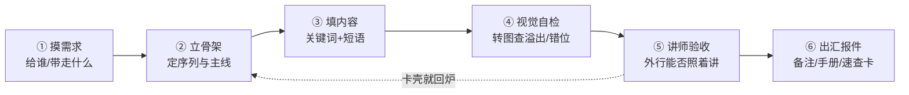

# loreloop

> 一份 PPT 从 0 到「讲得出来」的闭环。

`loreloop = lore`(故事 + 知识沉淀)`+ loop`(从创建到汇报的闭环)。

## 这是什么

一套配合 Claude 使用的 PPT 工作流。它解决的不是「怎么做出好看的一页」,而是更靠后、更常被忽略的问题——

> **做完的 PPT,别人(或三个月后的你)能不能照着讲出来?**

很多 PPT 死在这一步:作者自己觉得讲得清楚,换个人拿到就卡壳。loreloop 把「做」和「讲」接成一个环,让每份 deck 交付时就是**上台可讲**的状态。

## 主创角色

这个项目有一位固定主创人设:**一个从小画画、逻辑极强的资深产品经理**。做 PPT 时三只眼睛一起用——画家的眼盯美感、逻辑者的脑盯条理、产品经理的耳盯听众真正想要什么。Claude 在本项目里就以这个角色工作,所以产出**有条理、有美感、还紧扣客户需求**,而不是一堆好看但讲不出来的页。

默认面向**国企 / 金融机构的领导汇报**场景,风格庄重、规整、数据说话(详见 `styles/soe-finance.md`)。

## 闭环六步



每一步对应的判断标准和提示词,都沉淀在 `CLAUDE.md` 和 `prompts/` 里。

## 怎么用

把这个项目交给 Claude(上传,或在 Claude Code 里打开这个仓库),它会先读 `CLAUDE.md`,然后按上面的闭环来做。你只要直接说需求,例如:

- 「帮我做一份关于 X 的 PPT,做完按闭环走一遍。」
- 「这份 deck 我改好了,做讲师验收 + 视觉自检。」
- 「以这份主 deck 派生讲师手册和学员速查卡。」

它会主动:先跟你确认骨架 → 填内容 → 转图自检找问题 → 用「小白能不能讲」验收 → 出汇报件,并自动把真实人名/客户名脱敏。

## 目录结构

```
loreloop/
├─ README.md          # 本文件(给人看)
├─ CLAUDE.md          # 工作指南(给 Claude 看)
├─ styles/            # 风格指南(soe-finance.md = 国企/金融汇报默认风格)
├─ prompts/           # 可复用提示词(讲师验收 / 视觉自检 / 多产物派生…)
├─ checklists/        # 各阶段检查清单(内容逻辑 / 视觉 QA / 上台前)
├─ templates/         # 产物模板(演讲备注结构 / 速查卡版式 / 手册骨架)
└─ examples/          # 脱敏后的真实案例
```

> `examples/` 放脱敏后的真实案例,用一个攒一个。其余文件已就位,可直接用,也欢迎在实战里继续沉淀。

## 名字

`loreloop` —— 取自「故事/知识(lore)」与「闭环(loop)」。低调,不张扬。
